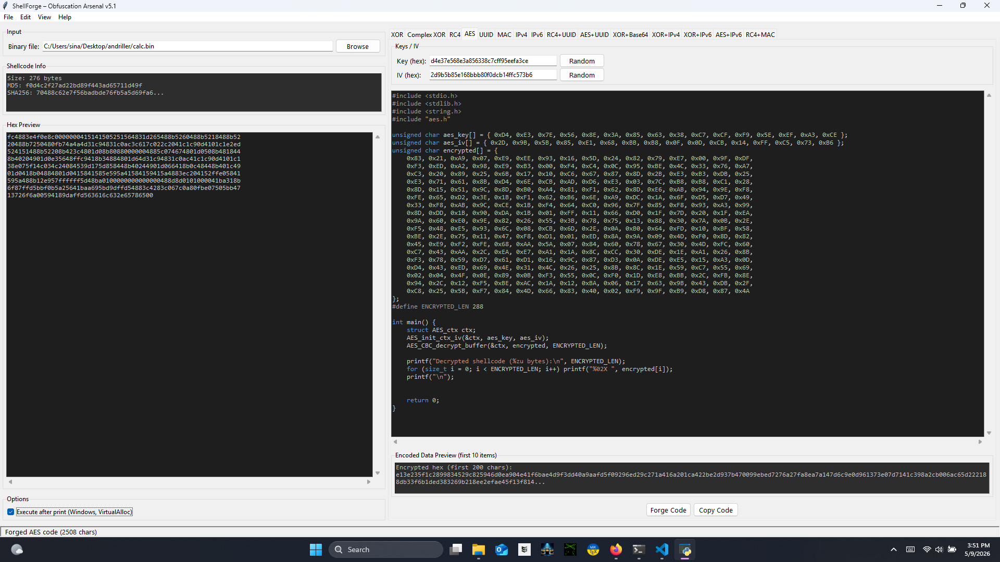

# ShellForge – Obfuscation Arsenal

**Generate dedicated C source code to extract, decrypt, and optionally execute shellcode using advanced obfuscation techniques.**  
Designed for red‑team operators, penetration testers, and malware analysts who need reliable, stealth‑focused payload generation.


---

## Table of Contents

- [Features](#features)
- [Screenshots](#screenshots)
- [Installation](#installation)
- [Quick Start](#quick-start)
- [Obfuscation Techniques](#obfuscation-techniques)
- [Example Generated Code](#example-generated-code)
- [Compiling the Generated C Code](#compiling-the-generated-c-code)
- [Why ShellForge?](#why-shellforge)


---

## Features

- **15 Obfuscation Methods** – Choose from pure encryption (XOR, RC4, AES), pure encoding (UUID, MAC, IPv4, IPv6), or combined techniques (RC4+UUID, XOR+Base64, etc.).
- **Dual Operation Mode** – Generate code that either **prints the decrypted shellcode as hex** (safe extraction) or **executes it directly** via `VirtualAlloc` on Windows.
- **Per‑Technique Controls** – Each tab allows custom key/IV entry, random key generation, and an instant preview of the encoded data.
- **Syntax‑Highlighted C Code** – The generated code appears with full C‑style syntax highlighting inside the GUI.
- **Safe Large‑Payload Handling** – Shellcode up to multiple megabytes is displayed in a truncated preview (100 KB); the complete code is always available via **Copy** and **Save** buttons.
- **Cross‑Platform GUI** – Built with Tkinter; runs on Windows, Linux, and macOS.
- **No External Dependencies for Most Techniques** – Only `pycryptodome` is required for AES; all other methods work out‑of‑the‑box.

---

## Screenshots



---

## Installation

### Requirements
- Python 3.8 or later
- Optional: `pycryptodome` for AES support

### Steps
1. Clone the repository:
   ```bash
   git clone https://github.com/yourusername/shellforge.git
   cd shellforge
   ```
2. (Recommended) Create a virtual environment:
   ```bash
   python -m venv venv
   source venv/bin/activate   # Linux/macOS
   venv\Scripts\activate      # Windows
   ```
3. Install optional AES dependency:
   ```bash
   pip install pycryptodome
   ```
4. Run the tool:
   ```bash
   python shellforge.py
   ```

---

## Quick Start

1. **Load your shellcode** – `File → Load Binary` (`.bin`) or `File → Load from Hex`.
2. **Select a technique** – Choose one of the 15 tabs (e.g., `RC4+UUID`).
3. **Configure keys** – Enter a custom hex key/IV or click `Random` to generate one.
4. **Toggle execution** – Check `Execute after print (Windows, VirtualAlloc)` if you want the generated program to run the shellcode.
5. **Generate** – Click `Forge Code`. The C source will appear in the editor.
6. **Export** – Use `Copy Code` to copy the full source to the clipboard, or `Save Full Code` to write it to a `.c` file.
7. **Compile** – See [Compilation Instructions](#compiling-the-generated-c-code) for building the executable on Windows.

---

## Obfuscation Techniques

| Technique        | Encryption      | Encoding          | Execution Support |
|------------------|-----------------|-------------------|-------------------|
| XOR              | XOR (4‑byte)    | –                 | Yes               |
| Complex XOR      | XOR with feedback (16‑byte) | –      | Yes               |
| RC4              | RC4 (16‑byte)   | –                 | Yes               |
| AES (CBC)        | AES-128‑CBC     | –                 | Yes¹              |
| UUID             | –               | UUID strings      | Yes               |
| MAC              | –               | MAC addresses     | Yes               |
| IPv4             | –               | IPv4 addresses    | Yes               |
| IPv6             | –               | IPv6 addresses    | Yes               |
| RC4+UUID         | RC4             | UUID strings      | Yes               |
| AES+UUID         | AES             | UUID strings      | Yes¹              |
| XOR+Base64       | XOR             | Base64            | Yes               |
| XOR+IPv4         | XOR             | IPv4 addresses    | Yes               |
| XOR+IPv6         | XOR             | IPv6 addresses    | Yes               |
| AES+IPv6         | AES             | IPv6 addresses    | Yes¹              |
| RC4+MAC          | RC4             | MAC addresses     | Yes               |

¹ Requires `pycryptodome` to be installed.

---

## Example Generated Code

Short example for a simple XOR technique (print‑only mode):

```c
#include <stdio.h>
#include <stdlib.h>
#include <string.h>
#include "aes.h"

unsigned char aes_key[] = { 0xD4, 0xE3, 0x7E, 0x56, 0x8E, 0x3A, 0x85, 0x63, 0x38, 0xC7, 0xCF, 0xF9, 0x5E, 0xEF, 0xA3, 0xCE };
unsigned char aes_iv[] = { 0x2D, 0x9B, 0x5B, 0x85, 0xE1, 0x68, 0xBB, 0xB8, 0x0F, 0x0D, 0xCB, 0x14, 0xFF, 0xC5, 0x73, 0xB6 };
unsigned char encrypted[] = {
    0x83, 0x21, 0xA9, 0x07, 0xE9, 0xEE, 0x93, 0x16, 0x5D, 0x24, 0x82, 0x79, 0xE7, 0x00, 0x9F, 0xDF,
    0xF3, 0xED, 0xA2, 0x98, 0xE9, 0xB3, 0x00, 0xF4, 0xC4, 0x0C, 0x95, 0xBE, 0x4C, 0x33, 0x76, 0xA7,
    0xC3, 0x20, 0x89, 0x25, 0x6B, 0x17, 0x10, 0xC6, 0x67, 0x87, 0x8D, 0x2B, 0xE3, 0xB3, 0xDB, 0x25,
    0xE3, 0x71, 0x61, 0x8B, 0xD4, 0x6E, 0xCB, 0xAD, 0xD6, 0xE3, 0x03, 0x7C, 0xB8, 0xB8, 0xC1, 0x28,
    0x8D, 0x15, 0x51, 0x9C, 0x8D, 0xB0, 0xA4, 0x81, 0xF1, 0x62, 0x8D, 0xE6, 0xAB, 0x94, 0x9E, 0xF8,
    0xFE, 0x65, 0xD2, 0x3E, 0x1B, 0xF1, 0x62, 0xB6, 0x6E, 0xA9, 0xDC, 0x1A, 0x6F, 0xD5, 0xD7, 0x49,
    0x33, 0xF8, 0xAB, 0x9C, 0xCE, 0x1B, 0xF4, 0x64, 0xC0, 0x96, 0x7F, 0x85, 0xF8, 0x93, 0xA3, 0x99,
    0x8D, 0xDD, 0x1B, 0x90, 0xDA, 0x1B, 0x01, 0xFF, 0x11, 0x66, 0xD0, 0x1F, 0x7D, 0x20, 0x1F, 0xEA,
    0x9A, 0x60, 0xE0, 0x9E, 0x82, 0x26, 0x55, 0x3B, 0x78, 0x75, 0x13, 0x88, 0x30, 0x7A, 0x0B, 0x2E,
    0xF5, 0x48, 0xE5, 0x93, 0x6C, 0x08, 0xCB, 0x6D, 0x2E, 0x0A, 0xB0, 0x64, 0xFD, 0x10, 0xBF, 0x58,
    0xBE, 0x2E, 0x75, 0x11, 0x47, 0xF8, 0xD1, 0x01, 0xED, 0x8A, 0x9A, 0x09, 0x4D, 0xF0, 0x8D, 0x82,
    0x45, 0xE9, 0xF2, 0xFE, 0x68, 0xAA, 0x5A, 0x07, 0x84, 0x60, 0x78, 0x67, 0x30, 0x4D, 0xFC, 0x60,
    0xC7, 0x43, 0xAA, 0x2C, 0xEA, 0xE7, 0xA1, 0x1A, 0x8C, 0xCC, 0x30, 0xDE, 0x1E, 0xA1, 0x26, 0x8B,
    0xF3, 0x78, 0x59, 0xD7, 0x61, 0xD1, 0x16, 0x9C, 0x87, 0xD3, 0x0A, 0xDE, 0xE5, 0x15, 0xA3, 0x0D,
    0xD4, 0x43, 0xED, 0x69, 0x4E, 0x31, 0x4C, 0x26, 0x25, 0x8B, 0x8C, 0x1E, 0x59, 0xC7, 0x55, 0x69,
    0x02, 0x04, 0x4F, 0x0E, 0x89, 0x0B, 0xF3, 0x55, 0x0C, 0xF0, 0x1D, 0xE8, 0xBB, 0x2C, 0xFB, 0x8E,
    0x94, 0x2C, 0x12, 0xF5, 0xBE, 0xAC, 0x1A, 0x12, 0xBA, 0x06, 0x17, 0x63, 0x9B, 0x43, 0xDB, 0x2F,
    0xC8, 0x25, 0x5B, 0xF7, 0x84, 0x4D, 0x66, 0x83, 0x40, 0x02, 0xF9, 0x9F, 0xB9, 0xD8, 0x87, 0x4A
};
#define ENCRYPTED_LEN 288

int main() {
    struct AES_ctx ctx;
    AES_init_ctx_iv(&ctx, aes_key, aes_iv);
    AES_CBC_decrypt_buffer(&ctx, encrypted, ENCRYPTED_LEN);

    printf("Decrypted shellcode (%zu bytes):\n", ENCRYPTED_LEN);
    for (size_t i = 0; i < ENCRYPTED_LEN; i++) printf("%02X ", encrypted[i]);
    printf("\n");


    return 0;
}

```

When the **Execute** option is enabled, the code additionally maps executable memory with `VirtualAlloc` and calls the shellcode.

---
> **⚡ Design Intent – Obfuscation, Not Evasion**  
> ShellForge was built with a single goal: **transform raw shellcode into benign‑looking C representations** that evade static signature detection and string‑based analysis.  
> It does **not** implement runtime evasion techniques (AMSI patching, ETW unhooking, syscall obfuscation, etc).
---
## Compiling the Generated C Code

The generated C files are **Windows‑specific** and must be compiled with a toolchain that provides the necessary system libraries.

### MSVC (Visual Studio)
```cmd
cl program.c /link Rpcrt4.lib ws2_32.lib
```

### MinGW‑w64
```cmd
gcc program.c -o program.exe -lrpcrt4 -lws2_32
```

**Note:**  
- Add `-lrpcrt4` when using UUID‑based techniques.  
- Add `-lws2_32` for IPv4/IPv6‑based methods.  
- If you used AES, the `aes.h` and `aes.c` files from a library like [tiny-AES-c](https://github.com/kokke/tiny-AES-c) must be present in your compilation folder.

---

## Why ShellForge?

# Just Try It


